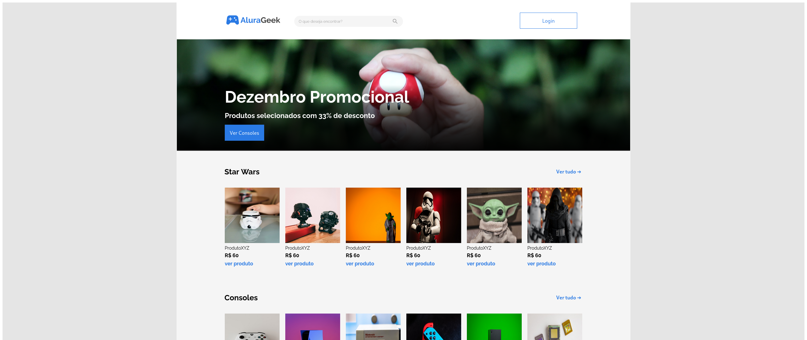

# Desafio Ecommerce 
Spring 02 Front-end do curso Alura/Project one Oracle

## Objetivo: 

__Criar uma pagina Ecommerce:__
- Uma página inicial que contenha um botão "iniciar sessão" e um buscador de produtos oferecidos pela empresa.
- Um banner que contenha descontos, promoções, ou informações relevantes do momento.
- Uma galeria com as informações dos produtos como: a imagem, o nome do produto, o preço e um link que leva até a página de descrição do produto.
- Uma página do produto que contenha a imagem, o nome, a descrição e o preço.
- Um rodapé com formulário para contato e outras informações relevantes.
- Menu administrador para eles conseguirem adicionar, editar, buscar ou eliminar produtos da loja.
**É muito importante que o site seja responsivo** para dar aos clientes a facilidade de comprar através de dispositivos mobiles.

## Ferramentas Usadas:

    

## Resultado

Link :  [https://andregomessilva.github.io/alura-geek/](https://andregomessilva.github.io/alura-geek/)

